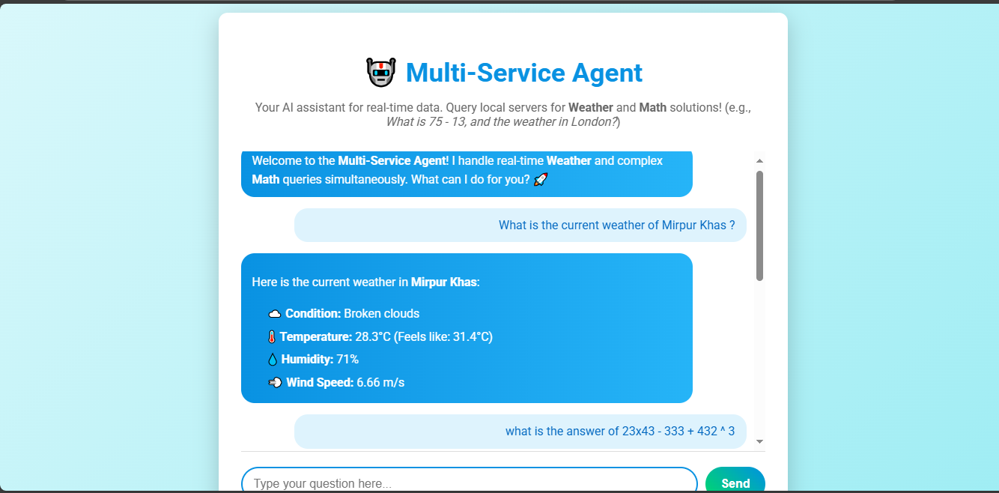

# Concierge AI Gateway: Multi-Service Agent Demo

<!-- ---------------------------------------------------- -->
<!-- 1. BADGES -->
<!-- ---------------------------------------------------- -->


[](https://opensource.org/licenses/MIT)


### This project provides a robust, asynchronous gateway built with **FastAPI** to expose a multi-service AI agent (using a system like LangChain/MCP) to a web frontend. The agent intelligently routes user queries to multiple specialized local servers (e.g., Math, Weather) and processes the results concurrently.
---

## 📸 Frontend UI Preview

[Please insert a screenshot of the chat interface here for quick visual reference.]

Example Markdown syntax to use:





---

## ✨ Features

* **Asynchronous API (`/ask`)**: Uses FastAPI's asynchronous capabilities (`async def`) to keep the web server responsive during complex, multi-step agent operations.
* **Agent Initialization**: Gracefully initializes the AI agent and its required Multi-Client Process (MCP) client on server startup (`@app.on_event("startup")`).
* **Clean Shutdown**: Safely terminates underlying tool server processes using `await MCP_CLIENT.ashutdown()` upon server shutdown to prevent orphaned processes.
* **CORS Configuration**: Fully configured for local development to allow the frontend (e.g., running on `localhost:5500`) to communicate with the Python backend (`localhost:8000`).

---

## ⚙️ Architecture Overview

* **api_gateway.py** acts as the single point of entry for the frontend application.
* **Frontend (HTML/JS)**: Sends a user query to the `/ask` endpoint.
* **api_gateway.py (FastAPI)**:

  1. Receives the query.
  2. Passes the query to the `get_agent_response` function (from `client.py`).
  3. The underlying **Agent** and **MultiServerMCPClient** execute required tools (like Math and Weather) in parallel.
  4. Returns the final, processed response to the frontend.

---

## 🚀 Getting Started

### Prerequisites

You will need **Python 3.8+** and the following packages (assuming your agent relies on FastAPI/Uvicorn, Pydantic, and the client library):

```bash
pip install fastapi uvicorn pydantic
# And any other necessary packages for your agent/client.py (e.g., langchain, etc.)
```

### Installation and Setup

1. **Ensure `client.py` is Ready**:
   Make sure your `client.py` file (which contains `setup_agent` and `get_agent_response`) is correctly configured and working locally.

2. **Start the Gateway**:
   Run the `api_gateway.py` file directly:

   ```bash
   python api_gateway.py
   ```

   The server will start at [http://127.0.0.1:8000](http://127.0.0.1:8000). You will see messages confirming agent initialization:

   ```
   --- Initializing Concierge AI Agent System ---
   --- Agent System Ready ---
   INFO:     Uvicorn running on http://127.0.0.1:8000 (Press CTRL+C to quit)
   ```

---

## API Endpoints

| Endpoint  | Method | Description                                                  | Payload Example                                              |
| --------- | ------ | ------------------------------------------------------------ | ------------------------------------------------------------ |
| `/ask`    | POST   | Processes a user query using the AI agent and returns result | `{"user_input": "What is 10 + 5 and the weather in Paris?"}` |
| `/status` | GET    | Simple health check to verify the agent is initialized       | N/A                                                          |

---

## Example Python Usage (Test the API)

You can test the `/ask` endpoint using `requests`:

```python
import requests
import json

url = "http://127.0.0.1:8000/ask"
payload = {"user_input": "What is 20 multiplied by 5?"}

response = requests.post(url, json=payload)
print(json.dumps(response.json(), indent=4))
```

---

## Server Shutdown

When you stop the server (e.g., pressing Ctrl+C), the `shutdown_event` handler ensures the MCP client cleanly closes all its background processes:

```
INFO:     Shutting down
--- Shutting down MCP Client subprocesses ---
--- MCP Client subprocesses shut down ---
```

> **Note:** This clean shutdown relies on the correct use of `await MCP_CLIENT.ashutdown()`, which prevents `AttributeError` issues.

